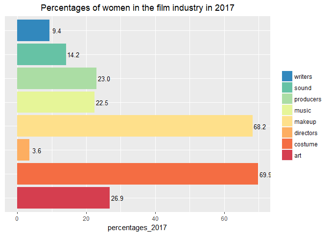
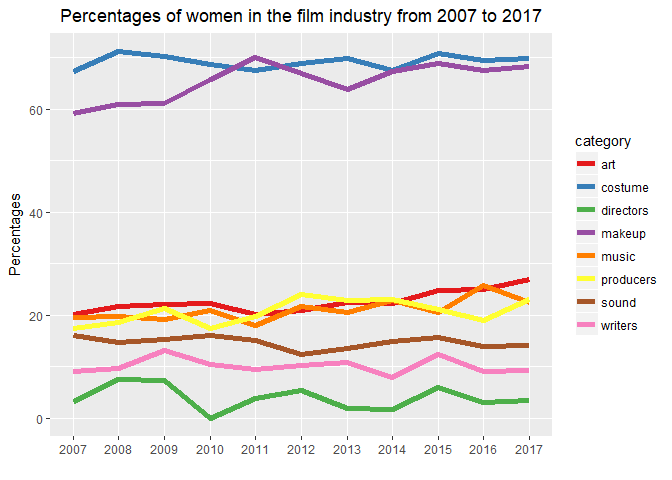
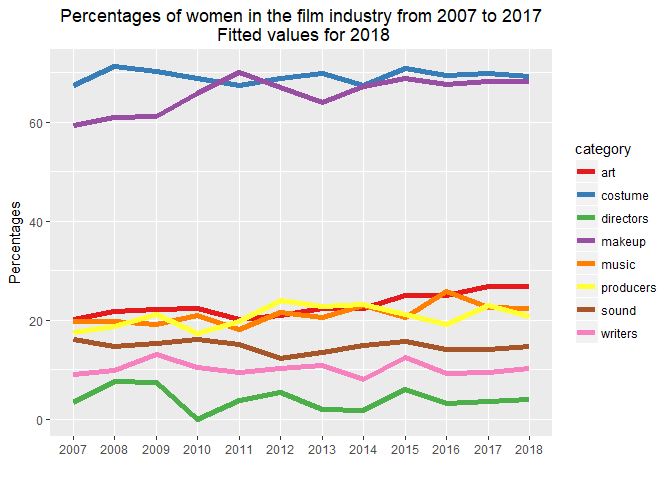

# Gender diversity in the film industry

The year 2017 has completely turned the film industry upside down. The allegations of harassment and sexual assault against Harvey Weinstein have raised the issue of the sexism and misogyny among this industry to the eyes of the general public. In addition, it helped raise the topic of the **gender non-diversity and the under-representation of women in Hollywood**. One of the main problem posed by the weak presence of women behind the camera is that this is reflected in the fictional characters on screen: lots of movies portray women in an incomplete, stereotyped and biased way.  

This project focuses on some key **behind-the-camera roles** to measure the evolution of their gender diversity in the last decade, from 2007 until 2017. The roles I studied were the following: **directors, writers, producers, sound teams, music teams, art teams, makeup teams and costume teams**. 

All the data used for this project was gathered from the **IMDb website**. The main objects I created and which gather the information I used to proceed with the analysis are available in the **data folder**.

Data frame creation - Web scraping
----------------------------------

What I needed first to proceed was a list which gathered the names
corresponding to these roles for a certain amount of movies. For each
year between 2007 and 2017, I gathered the information of the 50 most
profitable movies of the year from the **IMDb website**.

As a first step, I built data frames which contains the titles of these
movies, their gross and their IMDb crew links - the link where we can
find the names and roles of the whole movie crew. The following code is
aiming at building the corresponding data frame for the 50 most
profitable movies of 2017.

    # IMDB TOP US GROSSING 2017: 50 MORE PROFITABLE MOVIES OF 2017 -------------

    url <- "https://www.imdb.com/search/title?release_date=2017-01-01,2017-12-31&sort=boxoffice_gross_us,desc"
    page <- read_html(url)

    # Movies details
    movie_nodes <- html_nodes(page, '.lister-item-header a') 
    movie_link <- sapply(html_attrs(movie_nodes),`[[`,'href')
    movie_link <- paste0("http://www.imdb.com", movie_link)
    movie_crewlink <- gsub("[?]", "fullcredits?", movie_link) #Full crew links
    movie_name <- html_text(movie_nodes)
    movie_year <- rep(2017, 50)
    movie_gross <- html_nodes(page, '.sort-num_votes-visible span:nth-child(5)') %>%
      html_text()

    # CREATE DATAFRAME: TOP 2017 ----------------------------------------------

    top_2017 <- data.frame(movie_name, movie_year, movie_gross, movie_crewlink, stringsAsFactors = FALSE)

Let's have a look to the `top_2017` data frame:

    ##                                movie_name movie_year movie_gross
    ## 1 Star Wars: Episode VIII - The Last Jedi       2017    $620.18M
    ## 2                    Beauty and the Beast       2017    $504.01M
    ## 3                            Wonder Woman       2017    $412.56M
    ## 4          Jumanji: Welcome to the Jungle       2017    $404.26M
    ## 5         Guardians of the Galaxy: Vol. 2       2017    $389.81M
    ## 6                   Spider-Man Homecoming       2017    $334.20M
    ##                                                   movie_crewlink
    ## 1 http://www.imdb.com/title/tt2527336/fullcredits?ref_=adv_li_tt
    ## 2 http://www.imdb.com/title/tt2771200/fullcredits?ref_=adv_li_tt
    ## 3 http://www.imdb.com/title/tt0451279/fullcredits?ref_=adv_li_tt
    ## 4 http://www.imdb.com/title/tt2283362/fullcredits?ref_=adv_li_tt
    ## 5 http://www.imdb.com/title/tt3896198/fullcredits?ref_=adv_li_tt
    ## 6 http://www.imdb.com/title/tt2250912/fullcredits?ref_=adv_li_tt

I adapted the previous code in order to build equivalent data frames for
the past 10 years. I then had 11 data frames: `top2017`, `top2016`, ...,
`top2007`, which gathered the names, years, gross and crew links of the
50 most profitable movies of each year.

I combined these 11 data frames into one data frame called `top_movies`.

List creation - Web scraping
----------------------------

After that, I had a data frame with 550 rows, and I needed to build a
list which gathered:

-   the years from 2007 to 2017

-   for each year, the names of the top 50 grossing movies corresponding

-   for each movie, the names of the people whose job was included in
    one of the categories I listed above (director, writer, ..., costume
    teams)

In order to build this list, I navigated through all the IMDb full crew
web pages stored in our `top_movies` data frame, and did some **web
scraping** again to gather the information listed above.

    movies_list <- list()

    for (r in seq_len(nrow(top_movies))) {
      
      # FOCUS ON EACH MOVIE -----------------------------------------------------------------
      movie_name <- top_movies[r, "movie_name"]
      movie_year <- as.character(top_movies[r, "movie_year"])
      page <- read_html(as.character(top_movies[r, "movie_crewlink"]))
      
      # GATHER THE CREW NAMES FOR THIS MOVIE ------------------------------------------------
      movie_allcrew <- html_nodes(page, '.name , .dataHeaderWithBorder') %>%
        html_text()
      movie_allcrew <- gsub("[\n]", "", movie_allcrew) %>%
        trimws() #Remove white spaces 
      
      # SPLIT THE CREW NAMES BY CATEGORY ----------------------------------------------------
      movie_categories <- html_nodes(page, '.dataHeaderWithBorder') %>%
        html_text()
      movie_categories <- gsub("[\n]", "", movie_categories) %>%
        trimws() #Remove white spaces
        
      ## MUSIC DEPARTMENT -------------------------------------------------------------------
      movie_music <- c()
      for (i in 1:(length(movie_allcrew)-1)){
        if (grepl("Music by", movie_allcrew[i])){
          j <- 1
          while (! grepl(movie_allcrew[i], movie_categories[j])){
            j <- j+1
          }
          k <- i+1
          while (! grepl(movie_categories[j+1], movie_allcrew[k])){
            movie_music <- c(movie_music, movie_allcrew[k])
            k <- k+1
          }
        }
      }
      for (i in 1:(length(movie_allcrew)-1)){
        if (grepl("Music Department", movie_allcrew[i])){
          j <- 1
          while (! grepl(movie_allcrew[i], movie_categories[j])){
            j <- j+1
          }
          k <- i+1
          while (! grepl(movie_categories[j+1], movie_allcrew[k])){
            movie_music <- c(movie_music, movie_allcrew[k])
            k <- k+1
          }
        }
      }
      if (length(movie_music) == 0){
        movie_music <- c("")
      }
        
      ## IDEM FOR OTHER CATEGORIES ---------------------------------------------------------
        
      ## MOVIE_INFO CONTAINS THE MOVIE CREW NAMES ORDERED BY CATEGORY ----------------------
      movie_info <- list()
      movie_info$directors <- movie_directors
      movie_info$writers <- movie_writers
      movie_info$producers <- movie_producers
      movie_info$sound <- movie_sound
      movie_info$music <- movie_music
      movie_info$art <- movie_art
      movie_info$makeup <- movie_makeup
      movie_info$costume <- movie_costume
        
      ## MOVIES_LIST GATHERS THE INFORMATION FOR EVERY YEAR AND EVERY MOVIE ----------------
      movies_list[[movie_year]][[movie_name]] <- movie_info

    }

Here are some of the names I collected:

    ## - Star Wars VIII 2017, Director:
    ## Rian Johnson

    ## - Sweeney Todd 2007, Costume team:
    ## Colleen Atwood, Natasha Bailey, Sean Barrett, Emma Brown, Charlotte Child, Charlie Copson, Steve Gell, Liberty Kelly, Colleen Kelsall, Linda Lashley, Rachel Lilley, Cavita Luchmun, Ann Maskrey, Ciara McArdle, Sarah Moore, Jacqueline Mulligan, Adam Roach, Sunny Rowley, Jessica Scott-Reed, Marcia Smith, Sophia Spink, Nancy Thompson, Suzi Turnbull, Dominic Young, Deborah Ambrosino, David Bethell, Mariana Bujoi, Mauricio Carneiro, Sacha Chandisingh, Lisa Robinson

Gender determination
--------------------

All the names I needed to measure the gender diversity of these jobs
were now gathered in the list `movies_list`. Then, I had to determine
the gender of these almost 275,000 names. This is what the R package
**GenderizeR** does: "The genderizeR package uses genderize.io API to
predict gender from first names". At the moment, the genderize.io
database contains 216286 distinct names across 79 countries and 89
languages. The data is collected from social networks from all over the
world, which ensure the diversity of origins.

However, I was aware that determining genders based on names is not an
ideal solution: some names are unisex, some people do not recognize
themselves as men or women, and some transitioning transgender people
still have their former name. But this solution was the only option I
had, and as I worked on about 275,000 names, I assumed that the error
induced by the cases listed above was not going to have a big impact on
my results.

With this in mind, I used the **GenderizeR** package and applied its
main function on the lists of names I gathered earlier in `movies_list`.
The function `genderizeAPI` checks if the names tested are included in
the genderize.io database and returns:

-   the gender associated with the first name tested

-   the counts of this first name in database

-   the probability of gender given the first name tested.

The attribute I was interested in was obviously the first one, the
**gender** associated with the first name tested.

The aim was to focus on every category of jobs, and to count the number
of males and females by category, by film and by year. In brief with the
script below, here is the information I added to each object
`movies_list$year$film`:

-   the number of male directors,

-   the number of female directors,

-   the number of male producers,

-   the number of female producers,

-   ...,

-   the number of male in costume team,

-   the number of female in costume team.

The following code shows how I determined the gender of the directors'
names for every film in our `movie_list`. The code is similar for all
the other categories.

    # for each year
    for (y in seq_along(movies_list)){ 
      
      # for each movie
      for (i in seq_along(movies_list[[y]])){
        
    # Genderize directors -----------------------------------------------------
        directors <- movies_list[[y]][[i]]$directors
        
        if (directors == ""){
          directors_gender <- list()
          directors_gender$male <- 0
          directors_gender$female <- 0
          movies_list[[y]][[i]]$directors_gender <- directors_gender
        }
        
        else{
          # Split the firstnames and the lastnames
          # Keep the firstnames
          directors <- strsplit(directors, " ")
          l <- c()
          for (j in seq_along(directors)){
          l <- c(l, directors[[j]][1])
          }
      
          directors <- l
          movie_directors_male <- 0
          movie_directors_female <- 0
      
          # Genderize every firstname and count the number of males and females 
          for (p in seq_along(directors)){
            directors_gender <- genderizeAPI(x = directors[p], apikey = "233b284134ae754d9fc56717fec4164e")
            gender <- directors_gender$response$gender
            if (length(gender)>0 && gender == "male"){
              movie_directors_male <- movie_directors_male + 1
            }
            if (length(gender)>0 && gender == "female"){
              movie_directors_female <- movie_directors_female + 1
            }
          }
      
          # Put the number of males and females in movies_list
          directors_gender <- list()
          directors_gender$male <- movie_directors_male
          directors_gender$female <- movie_directors_female
          movies_list[[y]][[i]]$directors_gender <- directors_gender
        }  
        
    # Idem for the 7 other categories -----------------------------------------------------    

      }
    }

Here are some examples of numbers of male and female I collected:

    ## - Star Wars VIII 2017 
    ##  Number of male directors: 1 
    ##  Number of female directors: 0

    ## - Sweeney Todd 2007 
    ##  Number of male in costume team: 9 
    ##  Number of female in costume team: 20

Percentages calculation
-----------------------

Once I had all the gender information listed above, the next step was to
**calculate some percentages by year**. I then went through the whole
list `movies_list` and created a data frame called `percentages` which
gathered the percentages of women in each job category for each year.

Let's have a look to the `percentages` data frame:

    ##    year women_directors women_writers women_producers women_sound
    ## 1  2017        3.571429      9.386282        23.03030    14.17497
    ## 2  2016        3.174603      9.174312        19.04762    14.02918
    ## 3  2015        6.000000     12.432432        21.19914    15.69061
    ## 4  2014        1.785714      8.041958        23.12634    14.89028
    ## 5  2013        1.886792     10.769231        22.86282    13.54005
    ## 6  2012        5.357143     10.227273        24.06542    12.33696
    ## 7  2011        3.846154      9.523810        19.73392    15.08410
    ## 8  2010        0.000000     10.526316        17.40088    16.06700
    ## 9  2009        7.407407     13.157895        21.24711    15.30185
    ## 10 2008        7.547170      9.756098        18.67612    14.70588
    ## 11 2007        3.333333      9.047619        17.42243    16.13904

    ##    year women_music women_art women_makeup women_costume
    ## 1  2017    22.46998  26.87484     68.22204      69.89796
    ## 2  2016    25.84896  25.04481     67.54386      69.44655
    ## 3  2015    20.46163  24.90697     68.83117      70.83333
    ## 4  2014    22.86967  22.31998     67.29508      67.47430
    ## 5  2013    20.46482  22.45546     63.88697      69.79495
    ## 6  2012    21.62819  20.90395     66.95402      68.83539
    ## 7  2011    18.09816  20.22792     70.09482      67.44548
    ## 8  2010    20.90137  22.38199     65.81118      68.72082
    ## 9  2009    19.15734  22.14386     61.15619      70.25948
    ## 10 2008    19.82984  21.80974     60.87768      71.20253
    ## 11 2007    19.64385  20.21891     59.23310      67.36035

Visualisation - gender diversity in 2017
----------------------------------------

I was then able to visualise these percentages. For example, here is the
code I used to visualise the **gender diversity in 2017**.

    # Formating our dataframe
    percentages_t <- data.frame(t(percentages), stringsAsFactors = FALSE)
    colnames(percentages_t) <- percentages_t[1, ]
    percentages_t <- percentages_t[-1, ]
    rownames(percentages_t) <- c("directors", "writers", "producers", "sound", "music", "art", "makeup", "costume")

    # Ploting our barplot
    percentages_2017 <- percentages_t$`2017`
    y <- as.matrix(percentages_2017)

    p <- ggplot(percentages_t, aes(x = rownames(percentages_t),
                                   y = percentages_2017, 
                                   fill = rownames(percentages_t))) + 
      geom_bar(stat = "identity") +
      coord_flip() + # Horizontal bar plot
      geom_text(aes(label=format(y, digits = 2)), hjust=-0.1, size=3.5) + # pecentages next to bars
      theme(axis.text.y=element_blank(),
            axis.ticks.y=element_blank(),
            axis.title.y=element_blank(),
            legend.title=element_blank(),
            plot.title = element_text(hjust = 0.5)) + # center the title
      labs(title = "Percentages of women in the film industry in 2017") +
      guides(fill = guide_legend(reverse=TRUE)) + # reverse the order of the legend
      scale_fill_manual(values = brewer.pal(8, "Spectral")) # palette used to fill the bars and legend boxs

As we can see, in 2017, the behind-the-camera roles of both **directors
and writers** show the **most limited women occupation**: less than 10%
for writers and less than 4% for directors. This is really worrying
considering that these are key roles which determine the way women are
portrayed in front of the camera. Some studies have already shown that
the more these roles are diversified in terms of gender, the more gender
diversity is shown on screen.

Let's go back to our barplot. Women are also under-represented in sound
teams (14%), music teams (22.5%), producer roles (23%) and art teams
(27%). The only jobs which seem open to women are the **stereotyped
female jobs of make-up artists and costume designers**, among which
almost 70% of the roles are taken by women.

Visualisation - gender diversity evolution through the last decade
------------------------------------------------------------------

Even if those 2017 results are not exciting, I wanted to know whether
there had been an improvement through the last decade. The evolution I
managed to visualise is as follows.

    # From wide to long dataframe
    colnames(percentages) <- c("year", "directors", "writers","producers", "sound",    
                               "music", "art", "makeup", "costume")
    percentages_long <- percentages %>%
      gather(key = category, value = percentage, -year)
    percentages_long$year <- ymd(percentages_long$year, truncated = 2L) # year as date 

    # line plot
    evolution_10 <- ggplot(percentages_long, aes(x = year,
                                                 y = percentage,
                                                 group = category,
                                                 colour = category)) +
      geom_line(size = 2) +
      theme(panel.grid.minor.x = element_blank(),
            plot.title = element_text(hjust = 0.5)) + # center the title
      scale_x_date(date_breaks = "1 year", date_labels = "%Y") +
      scale_color_manual(values = brewer.pal(8, "Set1")) +
      labs(title = "Percentages of women in the film industry from 2007 to 2017",
           x = "",
           y = "Percentages")

The first thing I noticed is that **the representativeness gap between
the roles of make-up artists and costume designers and the other ones
has not decreased in a flagrant way since 2007**.

In addition, for the roles were women are really under-represented -
directors, writers and jobs related to sound, no improvement has been
achieved.

If we focus on directors, we do not see any trend. Figures vary
depending on the year we consider. For example **in 2010, we notice that
there is not any woman director amoung the 50 most profitable movies,
and for other years it never goes beyond 7.5%**. What is interesting for
the role of director is that the best woman's representation was reached
in 2008 and 2009, and after that, it has declined and never reached more
than 6%. Besides that, **the percentage of women directors reached in
2017 is substantially the same as the one reached in 2007**.

We then notice a **stability in sound teams and amoung writers**: women
consistently represent around 10% of writers and 15% of sound teams in
the last decade. But there is no sign of improvement.

Only a **slight improvement** of 3-5% is notable among **producers,
music and art teams**. But nothing astonishing.

Visualisation - gender diversity forecasting in 2018
----------------------------------------------------

The last step of our study was to forecast, at a basic level, these
percentages for 2018. I used the **forecast** package and its function
`forecast`, applied to the data I collected between 2007 and 2017, in
order to get this prediction.

    # Time series
    ts <- ts(percentages, start = 2007, end = 2017, frequency = 1)

    # Auto forecast directors 2018
    arma_fit_director <- auto.arima(ts[ ,2])
    arma_forecast_director <- forecast(arma_fit_director, h = 1)
    dir_2018 <- arma_forecast_director$fitted[1] # value predicted

    # Idem for writers, producers, sound, music, art, makeup and costume

    # Create a data frame for 2018 fitted values
    percentages_2018 <- data.frame(year = ymd(2018, truncated = 2L), 
                                   women_directors = dir_2018, 
                                   women_writers = writ_2018, 
                                   women_producers = prod_2018, 
                                   women_sound = sound_2018,
                                   women_music = music_2018,
                                   women_art = art_2018,
                                   women_makeup = makeup_2018,
                                   women_costume = costu_2018, 
                                   stringsAsFactors = FALSE)

    # Values from 2007 to 2017 + 2018 fitted values
    percentages_fitted_2018 <- bind_rows(percentages, percentages_2018)

    # From wide to long dataframe
    colnames(percentages_fitted_2018) <- c("year", "directors", "writers","producers", "sound",    
                                          "music", "art", "makeup", "costume")
    percentages_long_f2018 <- percentages_fitted_2018 %>%
      gather(key = category, value = percentage, -year)
    percentages_long_f2018$year <- ymd(percentages_long_f2018$year, truncated = 2L) # year as date

    # Forecast plot for 2018 
    forecast_2018 <- ggplot(percentages_long_f2018, aes(x = year,
                                                        y = percentage,
                                                        group = category,
                                                        colour = category)) +
      geom_line(size = 2)+
      theme(panel.grid.minor.x = element_blank(),
            plot.title = element_text(hjust = 0.5)) + # center the title
      scale_x_date(date_breaks = "1 year", date_labels = "%Y") +
      scale_color_manual(values = brewer.pal(8, "Set1")) +
      labs(title = "Percentages of women in the film industry from 2007 to 2017\n Fitted values for 2018",
           x = "",
           y = "Percentages")

The predicted values I got for 2018 are **approximately the same as the
one I calculated for 2017**. However it is a basic forecasting, and it
**does not take into consideration the upheaval** which happened in the
film industry in 2017. It will surely have an impact on the gender
diversity of this industry. But to what extent ? Has general awareness
been sufficient to truly achieve change ?

In any case, I sincerely hope that our forecasting is wrong and that a
constant improvement will be seen in the next couple of years, so that
**female characters on cinema screens would be more interesting and
complex.**
